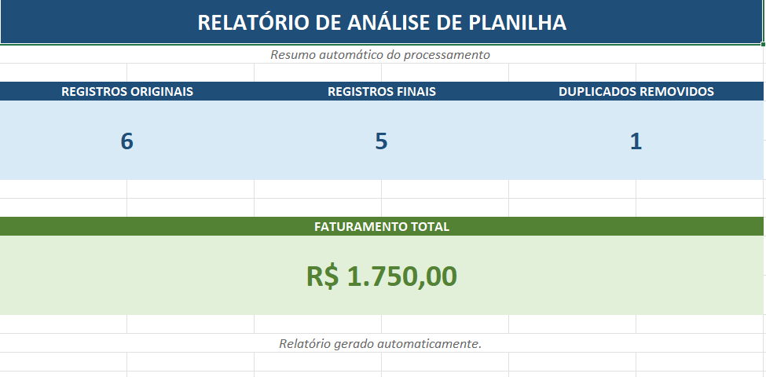
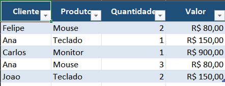

# Excel Automation Tool

Automatizador de planilhas desenvolvido em Python para limpeza, organização e análise de dados.

## 🚀 Funcionalidades

- Leitura de arquivos CSV e Excel
- Remoção de linhas duplicadas
- Limpeza de espaços em campos de texto
- Preenchimento de valores vazios
- Cálculo automático de faturamento
- Relatório Excel automatizado
- Resumo dos dados processados
- Análise por produto
- Análise por cliente
- Dashboard com indicadores
- Formatação profissional do arquivo Excel
- Tratamento de erros

## 🛠️ Tecnologias

- Python
- Pandas
- OpenPyXL

## 📁 Estrutura

```text
excel-automation-tool/
│
├── main.py
├── requirements.txt
├── README.md
│
├── entrada/
├── saida/
│
└── exemplos/
    └── vendas.csv


    # Excel Automation Tool

Automatizador de planilhas desenvolvido em Python para limpeza, organização e análise de dados.

## 📊 Dashboard



## 📑 Relatório gerado



## 🚀 Funcionalidades